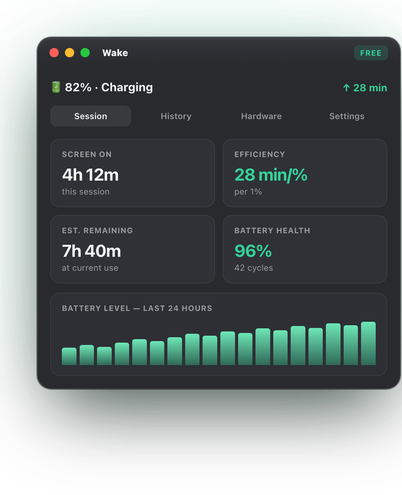
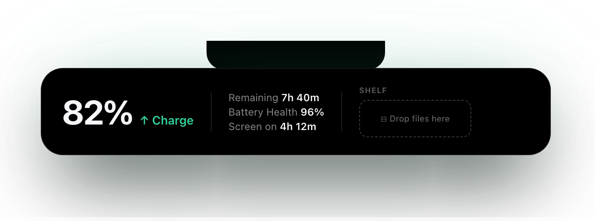
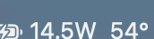
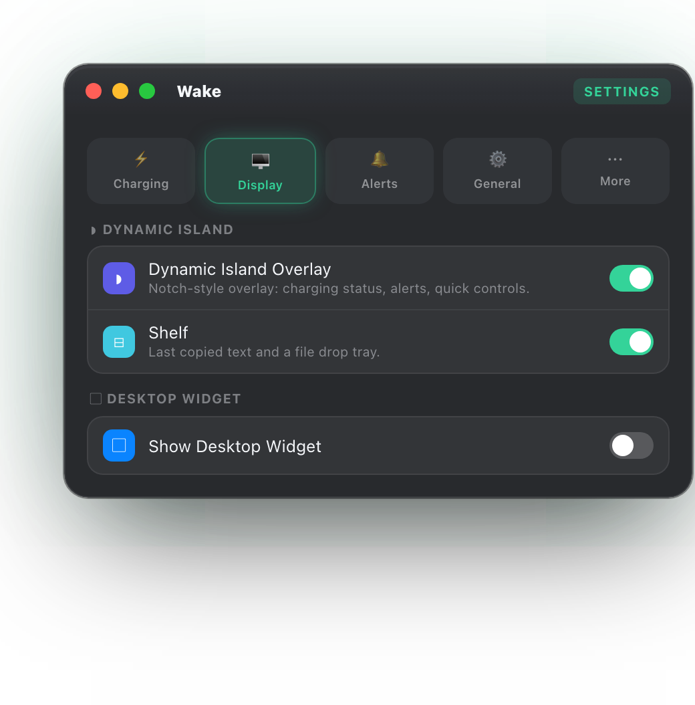

# 🔋 MacWake

[English](README.md) | [简体中文](README.zh-Hans.md) | [Türkçe](README.tr.md) | [日本語](README.ja.md) | [한국어](README.ko.md)

**MacWake**는 자세한 배터리 성능 상태, 사용 분석 및 충전 습관을 추적하도록 macOS용으로 설계된 세련된 메뉴 막대 및 데스크톱 위젯 앱입니다. Swift와 SwiftUI로 제작되었으며 현대적인 macOS 디자인 지침(글래스모피즘, 생동감 있는 효과)을 충실히 따릅니다.

<p align="center">
  
</p>

---

## 🖥️ Dynamic Island 및 메뉴 막대

노치 안의 **Dynamic Island**는 접힌 상태에서 하드웨어와 자연스럽게 어우러집니다. 포인터를 올리거나 클릭하면 탄력 있는 스프링 효과로 펼쳐지고 햅틱 피드백을 제공합니다. 실시간 전력, 배터리 성능 상태 및 배터리 온도를 표시하며 위젯, 세션 초기화, 애니메이션 및 알림을 위한 빠른 토글도 제공합니다.

<p align="center">
  
</p>

**메뉴 막대**에서는 실시간 전력 소비량을 한눈에 확인할 수 있으며(위 이미지), 클릭하면 세션, 기록, 하드웨어 및 설정이 포함된 전체 패널이 열립니다.

<p align="center">
  
</p>

<p align="center">
  
</p>

---

## ✨ 기능

*   **🔋 충전 제한(모든 Apple Silicon M 시리즈):**
    *   장기적인 배터리 마모를 줄이도록 50%에서 95% 사이의 원하는 수준으로 충전을 제한합니다.
    *   해당 기기가 실제로 제공하는 최적의 방식을 선택합니다. 칩 이름이 아니라 SMC가 실제로 노출하는 키를 보고 판단합니다(공증된 소형 백그라운드 도우미를 통해 작동하며, 한 번만 승인하고 암호를 요구하지 않음).
    *   **제한을 유지하는 방식은 Mac마다 다릅니다.** 충전 억제 키(CHTE/CH0C)가 있는 기기에서는 충전만 멈추고 Mac은 어댑터 전원으로 계속 작동합니다. 없는 기기에서는(현재까지 M4 이후) 어댑터 입력을 차단하는 것이 유일한 방법이므로 배터리가 제한까지 *방전되며*, macOS는 케이블이 연결된 상태에서도 배터리로 작동한다고 표시합니다. 설정에 어느 방식인지 표시되며, `진단 정보 복사`는 해당 기기가 가진 모든 CH\* 키를 나열합니다.
    *   **⛵ 세일링 모드:** 상한에서 미세 충전을 반복하는 대신, 배터리가 하한까지 내려간 후 다시 충전되도록 하여 사이클과 발열을 줄입니다.
    *   **🪫 수동 방전:** 전원에 연결된 상태에서 원하는 수준까지 방전합니다 — 충전 제한은 충전을 *멈추는* 것만 가능하지만, 이것은 95%에 멈춰 있는 Mac을 내려줍니다 — 이후 자동으로 충전을 재개합니다.
    *   **🧪 심층 배터리 보정:** 약 15%까지 방전하고 100%까지 충전한 다음 한 시간 유지하는 전체 사이클로 연료 게이지를 다시 보정합니다. 확인 후 “지금 보정”으로만 수동 시작할 수 있으며, 실시간 단계 상태와 취소 버튼을 제공합니다.
*   **⌨️ 명령줄 도구:**
    *   설정에서 `macwake` CLI를 설치하고 Terminal에서 충전을 제어하십시오: `macwake status`, `charging on|off`, `adapter on|off`, `energy auto|low|high`, `fan auto|<rpm>`.
*   **⚡️ 에너지 모드:**
    *   메뉴에서 바로 macOS 에너지 모드(자동 / 저전력 / 고성능 모드)를 전환할 수 있습니다. 고성능 모드는 이를 지원하는 Mac에서만 표시됩니다.
*   **🌀 모니터 탭 — 팬 + 상위 앱:**
    *   팬 상태, 1시간 속도 기록 및 수동 목표 RPM(실험적 기능 — 92°C를 넘으면 자동으로 시스템 제어로 복귀)을 전용 탭에서 제공합니다.
    *   실행 중인 상위 앱을 CPU 또는 RAM 기준으로 정렬하고 Activity Monitor / iStat Menus처럼 필요할 때만 샘플링합니다.
*   **🎯 스마트 충전 추가 기능:**
    *   원탭 제한 프리셋(60/70/80/90%), 여행하는 날을 위한 일회성 “이번에만 100%까지 충전” 재정의, 일정에 따른 완전 충전을 제공합니다. 매일 선택한 시간에 100%가 되도록 준비합니다.
    *   온도 보호 기능은 40°C를 넘으면 충전을 일시 중지하고 배터리가 식으면 다시 시작합니다.
    *   macOS 자체 알림보다 먼저, 선택한 수준에서 사용자 지정 배터리 부족 알림을 보냅니다.
*   **⚡️ Shortcuts 및 위젯:**
    *   Shortcuts 앱 동작: 충전 제한 설정, 이번에만 100%까지 충전, 청소 모드 시작, 배터리 상태 가져오기.
    *   배터리 링, 성능 상태, 온도 및 제한 상태를 보여 주는 네이티브 macOS 위젯(소형 및 중형).
    *   성능 상태/사이클 기록, 세션 및 어댑터 로그를 CSV로 내보냅니다.
*   **⚙️ 정리된 설정:**
    *   충전, 표시, 알림, 일반, 더 보기 — 모든 설정에 단 하나의 자리가 있고 각 항목에 한 줄 설명이 있습니다.
*   **🎛️ 사용자 지정 가능한 메뉴 막대:**
    *   메뉴 막대 항목에 표시할 내용(아이콘, 배터리 %, 전력/시간, 예상 잔여 시간 및 온도)을 실시간 미리보기와 함께 정확히 선택할 수 있습니다.
*   **🏝️ Dynamic Island(노치 UI):**
    *   물리적 노치를 감싸고 접었을 때 하드웨어와 자연스럽게 어우러지는 패널입니다.
    *   포인터를 올리거나 클릭하면 탄력 있는 스프링 애니메이션과 햅틱 피드백을 제공하며 펼쳐집니다.
    *   **선반** 내장: 노치로 파일을 끌어다 임시 보관하고, 마지막으로 복사한 텍스트를 한 번의 클릭으로 가져옵니다. 기본으로 켜짐.
    *   전력, 배터리 성능 상태 및 온도를 한눈에 보여 주며 빠른 토글(위젯, 초기화, 애니메이션, 알림)도 제공합니다.
*   **🌍 현지화:**
    *   영어, 터키어, 중국어 간체(简体中文), 일본어(日本語) 및 한국어 UI를 완전히 지원합니다. macOS 시스템 언어를 따르거나 MacWake 설정에서 언어를 선택한 뒤, 변경 사항을 적용하려면 다시 시작하십시오. WidgetKit 확장 프로그램은 계속해서 시스템이 제공하는 자체 언어 환경을 사용합니다.
*   **📊 상세 세션 추적(현재 세션):**
    *   화면 켜짐 시간과 잠자기 시간을 추적합니다.
    *   재시작/종료 감지로 데이터 무결성을 끊김 없이 유지합니다.
    *   배터리가 1% 감소할 때의 평균 화면 시간을 보여 주는 효율성을 계산합니다.
*   **🖱️ 반투명 데스크톱 위젯:**
    *   잠글 수 있고 데스크톱 어디에나 배치할 수 있는 플로팅 위젯입니다.
    *   Apple 스타일의 원형 배터리 잔량 표시기.
    *   배터리 온도와 사이클 수를 실시간으로 모니터링합니다.
*   **🔌 스마트 전원 어댑터 분석 및 하이브리드 알고리즘:**
    *   **⚡️ 하이브리드 전력 소비량:** 전원 연결 시 전체 시스템 전력 소비량(`SystemPowerIn`)과 배터리 사용 시 방전율(`InstantAmperage`)을 매끄럽게 결합하여, root(`sudo`) 권한 없이 메뉴 막대에 실시간(동적) Watt 소비량을 정확히 표시합니다.
    *   연결된 어댑터의 정격 전력(예: 30W)과 실제 충전 상태를 모니터링합니다.
    *   Apple 정품 어댑터 검증(MFI Check).
    *   사용 중인 포트(MagSafe, USB-C 또는 Thunderbolt)를 식별합니다.
    *   효율이 낮은 충전 상황을 위한 **저속 충전 알림**.
    *   사용했던 모든 충전기의 사용 횟수를 추적하는 어댑터 기록 로그.
*   **⏰ 빠른 배터리 소모 알림:**
    *   배터리 사용 중 최근 10분 이내의 급격한 배터리 감소(예: 5% 이상)를 감지하고 즉시 로컬 알림을 보냅니다.
*   **💫 iPhone 스타일 충전 애니메이션:**
    *   충전 케이블을 연결하면 현재 잔량을 표시하는 세련된 전체 화면 전환 애니메이션이 화면 중앙에 나타납니다(설정에서 켜거나 끌 수 있음).
*   **🛡️ 스마트 배터리 보호 및 온도 알림:**
    *   배터리 온도가 38°C 임계값을 넘으면 즉시 시각적 경고 카드와 로컬 알림을 표시합니다.
    *   기기가 99% 이상 충전 상태로 24시간 넘게 연속 연결되어 있으면 배터리 성능 상태를 보호하도록 방전 경고를 표시합니다.
*   **📈 배터리 성능 상태 저하 로그:**
    *   최대 배터리 용량이 바뀔 때마다 날짜와 사이클 수를 기록하는 자동 기록 로그입니다.
    *   하드웨어 탭의 세련된 타임라인에 과거 용량 저하를 표시합니다.
*   **🚀 간편한 접근 및 자동 시작:**
    *   로그인 시 자동으로 실행하는 옵션.
    *   다크/라이트 모드와 호환되는 고급 동적 색상 팔레트.

---

## 🛠️ 설치

### 옵션 1 — Homebrew(권장)

```bash
brew tap Jarvis322/tap
brew install --cask macwake
```

### 옵션 2 — 직접 다운로드

[GitHub Releases](https://github.com/Jarvis322/MacWake/releases/latest)에서 최신 최신 DMG를 다운로드하고 DMG를 연 다음 **MacWake.app**을 Applications 폴더로 드래그하십시오.

### 요구 사항
*   **macOS 14.0 (Sonoma)** 이상
*   Apple Silicon 또는 Intel — 다운로드는 유니버설 빌드이며 두 아키텍처에서 모두 네이티브로 실행됩니다
*   충전 제어(제한, Sailing 모드, 수동 방전, 캘리브레이션)는 Apple Silicon M 시리즈 SMC 키가 필요해 Intel에서는 사용할 수 없습니다. 모니터링, 상태 기록, 세션, 팬 표시, 위젯은 모든 기기에서 동작합니다

### 수동 Terminal 명령
명령줄에서 앱을 관리하려면 다음 명령을 사용하십시오.

*   **앱 실행:**
    ```bash
    open /Applications/MacWake.app
    ```
*   **앱 종료:**
    ```bash
    killall MacWake
    ```

---

## 📂 프로젝트 구조

*   `Sources/MacWakeApp.swift`: 앱 수명 주기, 메뉴 막대 통합 및 단일 인스턴스 관리.
*   `Sources/BatteryTracker.swift`: 전원 상태 추적(IOKit 및 IOPS), 세션 데이터 저장 및 알림 로직.
*   `Sources/MacWakeMenuView.swift`: 기본 UI 구성 요소 및 메뉴 막대 아이콘을 클릭하면 나타나는 타임라인 그래프.
*   `Sources/WidgetWindow.swift`: 플로팅 데스크톱 위젯 창, 드래그 로직 및 원형 표시기.
*   `Sources/ChargingAnimation.swift`: 충전 케이블을 연결할 때 실행되는 전체 화면 애니메이션 레이어.
*   `Sources/LaunchAgentManager.swift`: macOS `SMAppService` API를 사용하는 로그인 항목 구성.

---

## ❤️ 지원

MacWake는 무료이며 여가 시간에 개발하고 있습니다. 배터리 관리에 도움이 되었다면 [GitHub에서 후원](https://github.com/sponsors/Jarvis322)을 고려해 주십시오. 지속적인 개발을 직접 지원할 수 있습니다.

---

## 🔒 보안 및 권한

이 앱은 배터리 상태와 충전 어댑터를 모니터링할 때 관리자(root) 권한이 필요하지 않으며, 표준 macOS IOKit API만 사용합니다.
*   **알림:** 빠른 방전 알림을 받으려면 앱을 처음 실행할 때 알림 권한을 부여하는 것이 좋습니다(메뉴 아래의 “활성화/설정” 버튼에서 관리 가능).

---

## 📄 라이선스
이 프로젝트에는 **All Rights Reserved** 라이선스가 적용됩니다. 소스 코드, 디자인 및 컴파일된 빌드를 포함한 모든 지식 재산권은 작성자에게 있습니다. 소스를 무단으로 복사, 수정 또는 재배포하는 행위는 금지됩니다. 작성자는 Mac App Store를 포함하여 MacWake를 게시하고 배포할 독점적 권리를 보유합니다.
