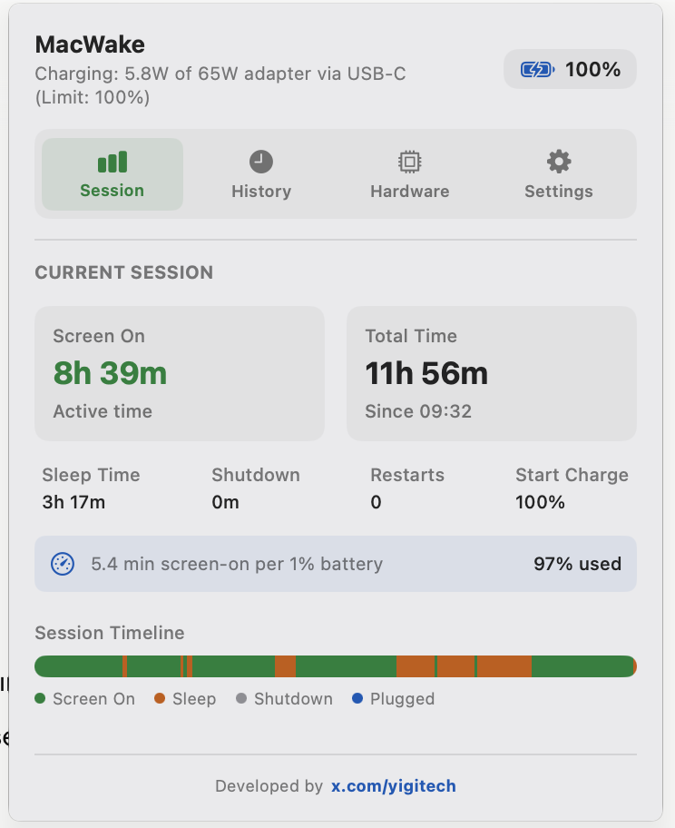
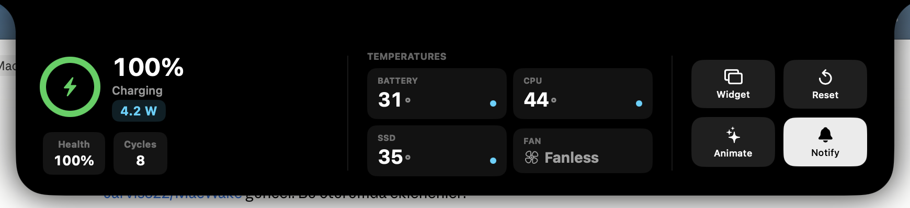
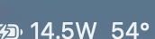

# 🔋 MacWake

**MacWake** is an elegant menu bar and desktop widget application designed for macOS to track detailed battery health, usage analytics, and charging habits. Built with Swift and SwiftUI, it faithfully embraces modern macOS design guidelines (glassmorphism, vibrant effects).

<p align="center">
  
</p>

---

## 🖥️ Dynamic Island & Menu Bar

A **Dynamic Island** lives in the notch: it stays
collapsed and blends with the hardware, expands on hover or click with a bouncy
spring, and gives haptic feedback. It surfaces live power, battery health, and
system temperatures (CPU / SSD, plus GPU where the chip exposes it), alongside
quick toggles for the widget, session reset, animations, and notifications.

<p align="center">
  
</p>

The **menu bar** shows real-time power draw and CPU temperature at a glance
(shown above), and clicking it opens the full panel — Session, History, Hardware
(with system temperatures), and Settings.

<p align="center">
  
</p>

---

## ✨ Features

*   **🏝️ Dynamic Island (Notch UI):**
    *   Panel that hugs the physical notch and blends with the hardware when collapsed.
    *   Hover or click to expand with a bouncy spring animation and haptic feedback.
    *   At-a-glance power, battery health, and system temperatures, plus quick toggles (widget, reset, animations, notifications).
*   **🌡️ System Temperatures (Apple Silicon):**
    *   Reads SoC/CPU and SSD (NAND) temperatures — and GPU where the chip exposes a discrete sensor — via the IOHIDEventSystemClient thermal interface.
    *   Surfaced in the menu bar (CPU °), the Dynamic Island temperature grid, and the Hardware tab. Unavailable sensors are hidden automatically.
*   **📊 Detailed Session Tracking (Current Session):** 
    *   Tracks screen-on time and sleep duration.
    *   Seamless data integrity with restart/shutdown detection.
    *   Efficiency calculation showing average screen time per 1% battery drop.
*   **🖱️ Translucent Desktop Widget:**
    *   Floating widget that can be locked and positioned anywhere on the desktop.
    *   Apple-style circular battery level indicator.
    *   Real-time battery temperature and cycle count monitoring.
*   **🔌 Smart Power Adapter Analysis & Hybrid Algorithm:**
    *   **⚡️ Hybrid Power Draw:** Seamlessly combines total system power draw (`SystemPowerIn`) when plugged in and discharge rate (`InstantAmperage`) when on battery to accurately display real-time (dynamic) Watt consumption in the menu bar, without requiring root (`sudo`) privileges.
    *   Monitors the nominal wattage (e.g., 30W) and actual charging status of the connected adapter.
    *   Apple Genuine adapter verification (MFI Check).
    *   Identifies the port in use (MagSafe, USB-C, or Thunderbolt).
    *   **Slow Charging Alert** for low-efficiency charging scenarios.
    *   Adapter History logging to track the usage count of all past chargers.
*   **🔋 macOS Optimized Battery Charging Compatibility:**
    *   Reads active charging limits (e.g., 80% Limit) from the background `powerd` service and continues to accurately display system power consumption even when the battery reaches its limit.
*   **⏰ Fast Battery Drain Notifications:**
    *   Detects sudden battery drops (e.g., 5% or more) within the last 10 minutes while on battery and sends an immediate local notification.
*   **💫 iPhone-Style Charging Animation:**
    *   An elegant, fullscreen transition animation that appears in the center of the screen when the charging cable is plugged in, displaying the current percentage (can be toggled in settings).
*   **🌀 Fan Speed and History Tracking (Fan Status):**
    *   Reads real-time fan speed (RPM) directly via the SMC (System Management Controller).
    *   Displays a sparkline chart of fan speed changes over the last hour for actively cooled devices.
    *   Alternative sleek info panel for fanless devices like the MacBook Air.
*   **🛡️ Smart Battery Protection & Temperature Alerts:**
    *   Immediate visual warning card and local notification when battery temperature exceeds the 38°C threshold.
    *   Discharge warning to protect battery health if the device remains plugged in at 99%+ charge for more than 24 consecutive hours.
*   **📈 Battery Health Decay Log:**
    *   Automated historical log that records the date and cycle count every time the maximum battery capacity changes.
    *   Displays a stylish timeline of retroactive capacity degradation in the Hardware tab.
*   **🚀 Easy Access & Auto-Start:**
    *   Option to automatically Launch at Login.
    *   Advanced dynamic color palette compatible with dark/light modes.

---

## 🛠️ Installation & Execution

### Requirements
*   **macOS 14.0 (Sonoma)** or any newer macOS version.
*   **Swift Command Line Tools** or **Xcode** (for compilation).

### Build and Install
You can use the provided build script to compile the application, code-sign it locally, and move it to the `/Applications` folder:

```bash
# Navigate to the project directory
cd MacWake

# Make the build script executable and run it
chmod +x build.sh
./build.sh
```

Once the script completes, the app will be installed as `/Applications/MacWake.app` and will launch automatically.

### Manual Terminal Commands
If you wish to manage the app via the terminal:

*   **To Launch the App:**
    ```bash
    open /Applications/MacWake.app
    ```
*   **To Quit the App:**
    ```bash
    killall MacWake
    ```

---

## 📂 Project Structure

*   `Sources/MacWakeApp.swift`: Application lifecycle, menu bar integration, and single-instance management.
*   `Sources/BatteryTracker.swift`: Power state tracking (IOKit & IOPS), session data storage, and notification logic.
*   `Sources/SMCHelper.swift`: Module for direct reading of hardware data and fan speeds from the SMC (System Management Controller).
*   `Sources/MacWakeMenuView.swift`: Main UI components and timeline graphs revealed upon clicking the menu bar icon.
*   `Sources/WidgetWindow.swift`: Floating desktop widget window, drag logic, and circular indicator.
*   `Sources/ChargingAnimation.swift`: Fullscreen animation layer triggered when the charging cable is connected.
*   `Sources/LaunchAgentManager.swift`: Login item configuration using the macOS `SMAppService` API.

---

## 🔒 Security & Permissions

The application does not require any administrator (root) privileges to monitor battery status and charging adapters; it relies entirely on standard macOS IOKit APIs. 
*   **Notifications:** To receive fast discharge alerts, it is recommended to grant notification permissions when the app first launches (this can be managed via the "Enable/Settings" button under the Menu).

---

## 📄 License
This project is licensed under **All Rights Reserved**. All intellectual property rights, including source code, designs, and compiled builds, are reserved. Unauthorized copying, modification, distribution, or publishing on any platform, including the App Store, is strictly prohibited.
